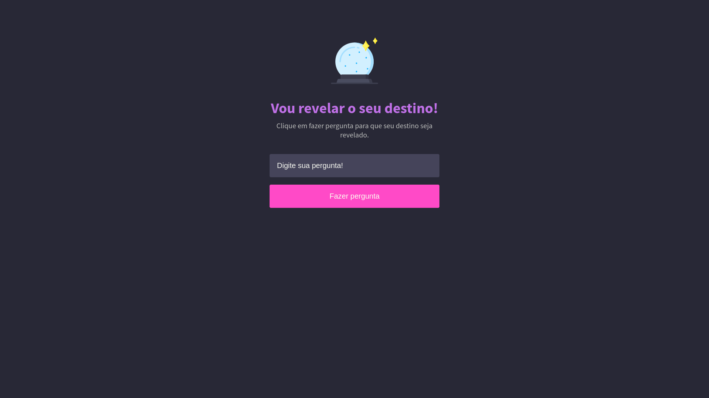

<h1 align="center"> 
   
  RevealYourDestiny
</h1>

  
  

 

  

<h2 align="center">:computer: Projeto:</h2>

  
  <strong>Faça a sua pergunta para saber sobre o seu destino.</strong>

 

## :rocket: Tecnologias utilizadas:

* [HTML](https://developer.mozilla.org/pt-BR/docs/Web/HTML)
* [CSS](https://developer.mozilla.org/pt-BR/docs/Web/css)
* [Javascript](https://developer.mozilla.org/pt-BR/docs/Web/JavaScript)

# :memo: Licença

Esse projeto está sob a licença MIT. Veja o arquivo [LICENSE](LICENSE.md) para mais detalhes.
